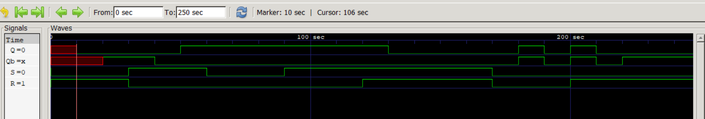
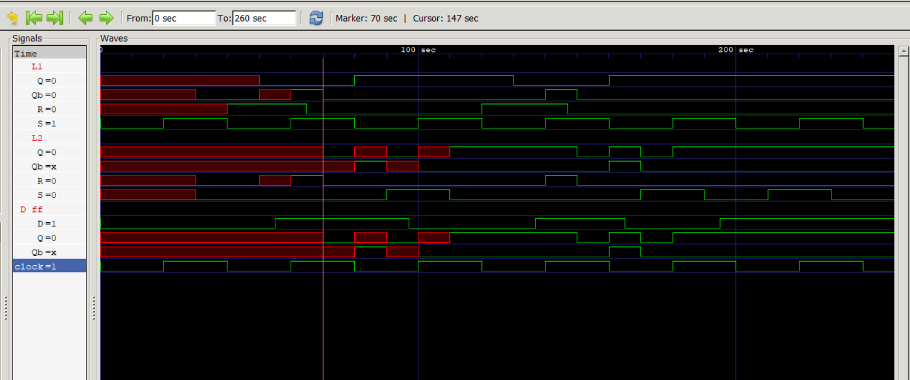
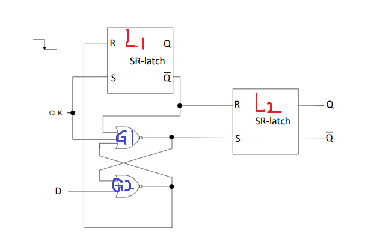
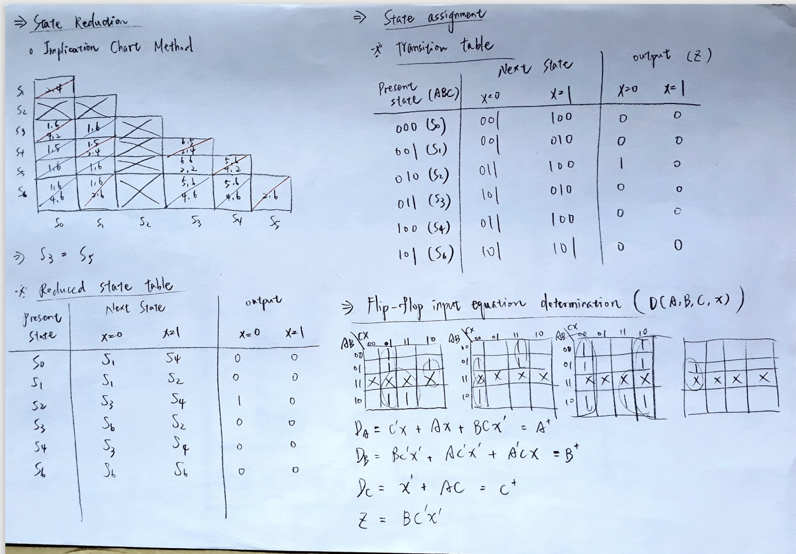
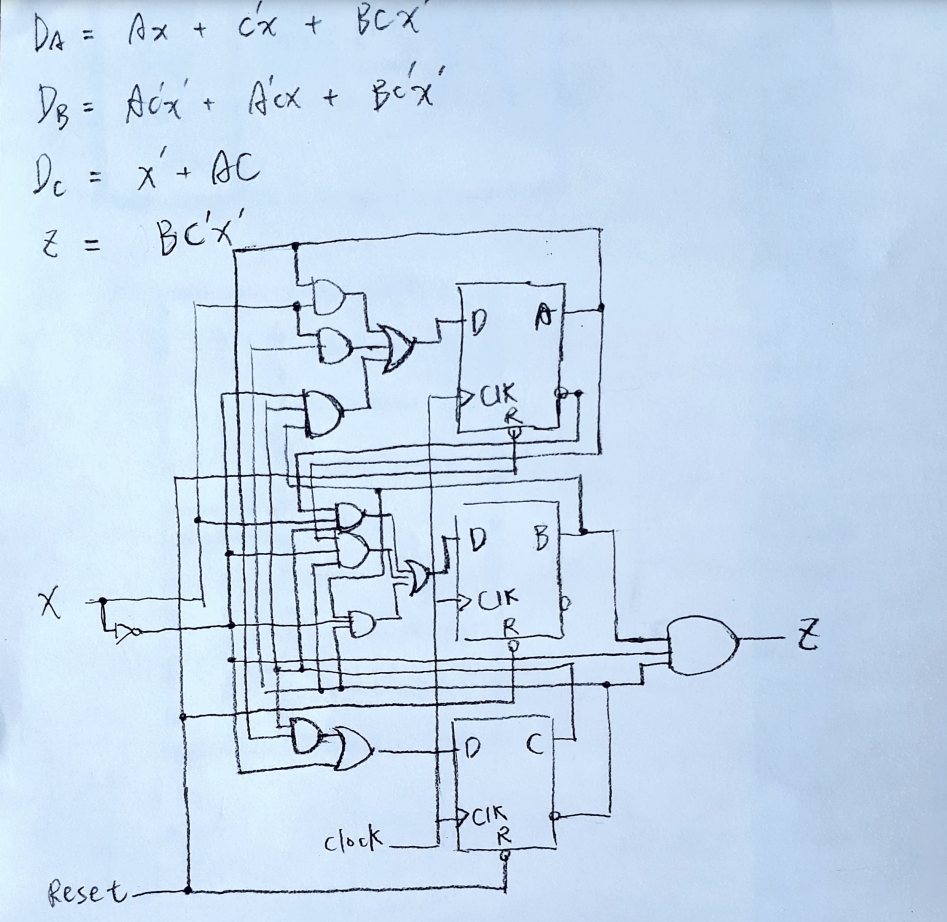
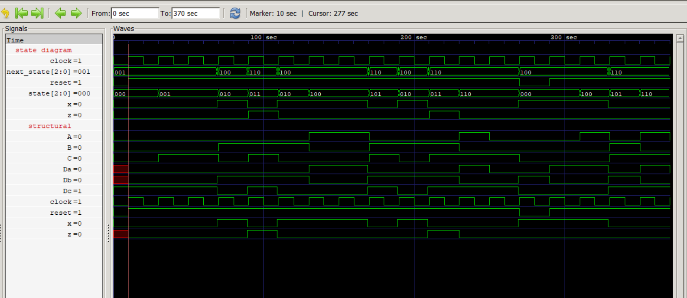
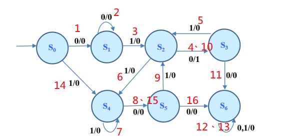

#### (1)

> （圖一：SR latch waveform）
> 

　　波形圖顯示，Q delay 了 10 time unit，而 Qb delay 了 20 time unit：因為 NOR gate 的 propagation delay 為 10 time unit，要穩定輸出，兩個 NOR gate 都至少要通過一次。當 (S, R) = (0, 1) 轉換至 (S, R) = (1, 0)，因為過程中有 (Q, Qb) = (0, 0) 這個不穩定態，所以輸出延遲了 20 time units 才呈現正確的 (1, 0)，與預期相符；自 (S, R) = (1, 1) 轉換至 (S, R) = (0, 0) 的後續震盪也符合預期；因此波型圖正確。

#### (2)

> （圖二：D flip-flop waveform）
> 
>
> （圖三：D flip -flop circuit）
> 

首先列出 timing parameters：

* setup time: $t_s = G2 + G4$，$G4$ 是 $L1$ 內連接到 R 的 NOR gate
* hold time: $t_h = max(G1, G3)$，$G3$ 是 $L1$ 內連接到 S 的 NOR gate
* propagation time: $t_{pd} = max(G1, G3) + L2$ 

　　從 t = 0 到 t = 55，D 都保持是 0，但是必須到 t = 20 也就是 clock = 1 之後，且再經過 10 time unit、當 G1's output 為 0 時，才可以開始計算 setup time；此時 t = 30。又 $t_s = G2 + G4 = 20$，$30 + t_s = 50< 55$，所以 setup 沒問題。clock 於 t = 40 時 transition，開始計算 hold time，而 $t_h = max(G1, G3) = 10$，$40 + 10 = 50< 55$，hold 也沒問題。但是因為 setup 完成的時間點在clock transition 之後 ($50 > 40$)，G3 的 output 將有一段時間是 don't care，可於圖二波型圖中看出；如此也使 $t_{pd}=max(G1, G3)+L2 = (50-40)+10+20=40$，亦即 40 time units 過後：t = 80 時 D flip-flop 才有穩定的輸出。

　　但是，在 t = 80 與 t = 110 之間，輸出卻依然不穩定，與預期相悖；這是因為在 G3 的輸出終於不是 don't care 時 (t = 60)，clock 也從 0 變 1，代表 G2、G4 要開始 setup 新的 D 值，G1、G3 則會被設為 0。正是此 G3 的變動造成 D flip-flop 輸出的不穩定。直到 G1 輸出 1 (因為此時 D = 1)，直接決定 L2 的 $\bar Q$ 為 0，D flip-flop 才穩定輸出。後續波型以此類推，結果無誤。

#### (3)

> （圖四之一：Design Procedure 1）
> 
>
> （圖四之二：Circuit Diagram）
> 
>
> （圖五：Waveform）
> 
>
> （圖六：State diagram）
> 

設計過程：

1. state reduction，利用 implication chart method，發現 $S_3 = S_5$ 。
2. state assignment，只有將 $S_6$ 重新 assign 成 *101*，其餘照舊。
3. flip-flop input equation determination

詳細過程載於圖四之一；電路圖於圖四之二。

　　在 testbench 中，我宣告了 ` reg [15:0] inputs = 'b0011000101110100;`，代表 machine 在測試過程中依序接受的 inputs；這樣的 inputs 可以導致圖六的 state transition，紅字代表 transition 的順序。其中，第 13 次到第 14 次的 state transition 之間，必須先 reset、自 $S_0$ 重新出發，以測試所有可能的狀態轉移。

　　由於只有從 $S_2$ 到 $S_3$，output z 才會是 1，所以僅在第 4 和 10 次狀態轉移 z 才會等於 1，其餘為 0；圖五波型圖與此符合。

　　經過上述的完整測試，state diagram 和 structural，兩種方法所設計的電路產生一樣的輸出，且不違背預測，因此兩者的波型皆正確。

#### (4)

　　首先，Verilog 的 sequential circuit 與 combinational circuit 的寫法大不相同。不只要熟悉語法，更要清楚背後的運作邏輯，才可能寫出正確的程式。

　　再來就是分析波型圖。分析 sequential circuit 的波型圖要考慮的因素多了很多，尤其像這次的 D flip-flop，當下的、延遲的訊號混雜在一起，還有 don't care 摻雜，實在混亂。這是我在這次作業花最多時間的地方。
